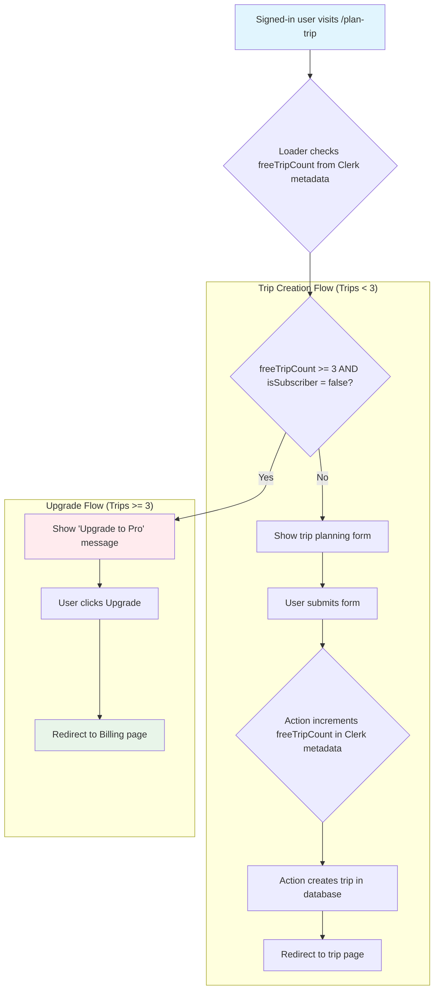

# Signed-In User: Trip Creation & Upgrade Flow

This document outlines the journey for a signed-in user on the free plan, from creating their allotted free trips to upgrading to a Pro plan for unlimited access. This flow is based on a direct analysis of the codebase.

## What Happens Behind the Scenes

### Trip Limit Logic:

1.  **Data Loading (`plan-trip.loader.ts`)**: When a user visits the `/plan-trip` page, the loader fetches the `userId` and subscription status from Clerk. If the user is signed in, it retrieves the `freeTripCount` from the user's `privateMetadata` stored in Clerk.
2.  **UI Rendering (`PlanTripPage.tsx`)**: The frontend receives the `freeTripCount` and `isSubscriber` flags. It conditionally renders either the trip planning form or an "Upgrade to Pro" message if the user has reached their 3-trip limit and is not a subscriber.
3.  **Trip Creation & Count Increment (`plan-trip-action.ts`)**: When a non-subscriber submits the form, the action does two things:
    - It sends a request to create the trip in the application's database.
    - It makes a separate call to the Clerk API to fetch the current `freeTripCount`, increments it by one, and updates the user's `privateMetadata`.

### Upgrade Process:

- **Upgrade CTA**: When the `freeTripCount` is 3 or more, the UI presents the user with a button to upgrade.
- **Billing Page**: Clicking the upgrade button redirects the user to the billing page to subscribe to the Pro plan.
- **Account Update**: Once subscribed, the `isSubscriber` flag will be true, and the trip limit will no longer apply.

## Key User Experience Points

✅ **Seamless Trip Saving**: As a signed-in user, every trip you generate is automatically saved to your account without any extra steps.
✅ **Clear and Fair Limits**: You can create three complete trips for free. The system clearly informs you when you've reached this limit, so it's never a surprise.
✅ **Uninterrupted Flow**: Your planning process isn't interrupted by premature upgrade prompts. The option to subscribe appears only when you've used all your free trips.
✅ **Consistent Experience**: Your trip count is tied to your account, ensuring the same experience and limits whether you're on your desktop or phone.

## Visual Flow Summary

**Visit Page → Loader Checks Count → UI Displays Form/Upgrade → Action Increments Count & Creates Trip**
