# Visitor Trip Creation Flow

```mermaid
flowchart TD
    A[Visitor visits plan trip page] --> B[Sees clean trip form]
    B --> C[Form shows destination dropdown, date picker, headcount input, duration select, generate button]

    C --> D[Visitor fills form and clicks Generate]
    D --> E[Form disappears]
    E --> F[Loading screen appears]

    F --> G[Progress bar starts at 0%]
    G --> H[Progress bar fills over 15 seconds]

    H --> I[Status messages change: Analyzing fishing conditions, Finding the best spots, Checking weather patterns, Finalizing trip plan]

    I --> J[Progress reaches 100%]
    J --> K[Auto-navigate to trip page]

    K --> L[Trip page loads]
    L --> M[Shows complete trip with sections]

    M --> N[Info Cards: Destination, Date, Duration, Participants]
    N --> O[Travel Details: Airport, Cities]
    O --> P[Budget List: Auto-generated costs]
    P --> Q[Packing List: Auto-generated items]
    Q --> R[Checklist: Auto-generated tasks]
    R --> S[Tactics: Fishing summary, Weather, Flies, Hatches]
    S --> T[Notes: AI-generated insights]

    T --> U[Sign Up CTA appears]
    U --> V[CTA shows: Want to save this trip? Sign up for free to access trip management tools]

    V --> W[Visitor clicks Sign Up Free]
    W --> X[Navigate to login page]
    X --> Y[Login/signup modal appears]

    style A fill:#e1f5fe
    style B fill:#f3e5f5
    style F fill:#fff3e0
    style L fill:#e8f5e8
    style U fill:#ffebee
    style Y fill:#f1f8e9
```

## What Happens Behind the Scenes

### When Visitor Submits Form:

1. **Backend receives**: Destination, date, headcount, duration (no user ID)
2. **AI Service**: Generates fishing-specific content (flies, weather, tactics)
3. **Database**: Creates trip record with status "Generating"
4. **Default Data**: Auto-generates packing list, budget, and checklist

### During Loading Animation:

- **AI Processing**: Content generation happens asynchronously
- **Progress Bar**: Frontend animation (not tied to actual processing)
- **Database**: Trip status remains "Generating"

### When Trip Page Loads:

1. **Backend fetches**: Trip data from database
2. **AI Service**: Retrieves completed content
3. **Database**: Updates trip status to "Planned"
4. **Frontend**: Displays complete trip with all sections

## Key User Experience Points

✅ **No Login Required**: Visitors can create trips immediately  
✅ **Instant Feedback**: Loading animation keeps user engaged  
✅ **Rich Content**: AI generates fishing-specific recommendations  
✅ **Complete Trip**: All sections auto-populated with relevant data  
✅ **Conversion Focus**: Clear sign-up CTA after trip creation

## Visual Flow Summary

**Form → Loading → Trip Display → Sign Up Prompt**

The entire flow takes about 15-20 seconds and requires no account creation.
